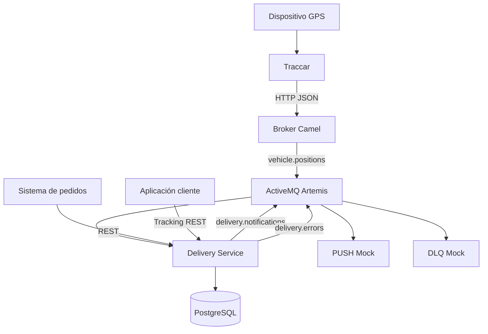

# Seguimiento de Pedidos por Delivery

Integración de **Traccar**, **Apache Camel**, **ActiveMQ Artemis** y **PostgreSQL** para registrar pedidos, procesar posiciones GPS, calcular la distancia al destino y notificar los hitos de una entrega.

Proyecto desarrollado para el **Desafío 3 — Seguimiento de Pedidos por Delivery por Coordenadas GPS** de Integración de Sistemas II.

## Integrantes

- Hernan Silgueira
- Antonio Aguero
- Victor Martinez

## Funcionalidades

- Registro y consulta de pedidos mediante API REST.
- Inicio controlado de la entrega.
- Recepción de posiciones GPS desde Traccar.
- Correlación entre `deviceId` y el pedido activo.
- Cálculo de distancia mediante la fórmula de Haversine.
- Actualización de la última posición conocida.
- Cambio automático de `EN_CAMINO` a `CERCA`.
- Confirmación de entrega.
- Consulta de tracking del pedido.
- Notificaciones PUSH simuladas mediante Artemis.
- Notificaciones idempotentes por pedido e hito.
- Canal de errores para mensajes no procesables.
- Pruebas unitarias del cálculo de distancia.

## Arquitectura



El módulo `delivery-service` actúa como **Process Manager** y orquesta el ciclo de vida:

```text
RECIBIDO → EN_CAMINO → CERCA → ENTREGADO
```

Las posiciones, notificaciones y errores se procesan mediante mensajería orientada a eventos. No se utiliza polling sobre PostgreSQL.

## Tecnologías

- Java 21
- Apache Camel 4.8.0
- Gradle Wrapper 9.6.1
- ActiveMQ Artemis y AMQP 1.0
- Qpid JMS
- PostgreSQL 17
- Traccar
- Docker y Docker Compose
- JUnit 5

## Patrones EIP

| Patrón | Implementación | Responsabilidad |
|---|---|---|
| Messaging Gateway | `broker` | Recibe HTTP y publica en Artemis. |
| Content-Based Router | `IngestRoute` | Clasifica posiciones y eventos. |
| Message Translator | Traductores del broker | Convierte el payload de Traccar al modelo canónico. |
| Canonical Data Model | `common` | Define `VehiclePosition` y `VehicleEvent`. |
| Publish-Subscribe Channel | `vehicle.positions` | Distribuye posiciones GPS. |
| Durable Subscriber | Consumidores AMQP | Conserva las suscripciones. |
| Message Filter | Tracking GPS | Rechaza posiciones inválidas. |
| Correlation Identifier | `pedidoId`, `deviceId` | Relaciona pedidos, repartidores y eventos. |
| Process Manager | `delivery-service` | Orquesta el ciclo de entrega. |
| Idempotent Receiver | `pedido_eventos` | Evita eventos y notificaciones duplicadas. |
| Dead Letter Channel | `delivery.errors` | Recibe mensajes no procesables. |
| Wire Tap | Notificaciones y errores | Publica copias asíncronas. |

## Canales de mensajería

| Canal | Tipo | Responsabilidad |
|---|---|---|
| `ingest` | Queue | Entrada de forwards de Traccar. |
| `vehicle.positions` | Topic | Posiciones GPS canónicas. |
| `vehicle.events` | Topic | Eventos canónicos de Traccar. |
| `delivery.notifications` | Queue | Notificaciones de hitos. |
| `delivery.errors` | Queue | Mensajes no procesables. |

## Persistencia

PostgreSQL utiliza las siguientes tablas:

- `repartidores`: datos maestros precargados.
- `pedidos`: información y estado de cada entrega.
- `pedido_ultima_posicion`: última posición y distancia calculada.
- `pedido_eventos`: bitácora de hitos y control de notificaciones.

La restricción única `(pedido_id, hito)` evita duplicar eventos. Un índice único parcial permite solamente un pedido activo por repartidor.

Para publicar una notificación, el servicio ejecuta una operación atómica `UPDATE ... RETURNING` sobre un evento con `notificado=false`. Solamente la ejecución que reclama la fila publica el mensaje.

## Puertos

| Servicio | Puerto local |
|---|---:|
| Broker HTTP | 8080 |
| Delivery Service | 8081 |
| Traccar Web/API | 8082 |
| Traccar OsmAnd | 5055 |
| Artemis AMQP | 5672 |
| Artemis Core/OpenWire | 61616 |
| Artemis MQTT | 1883 |
| Artemis Console | 8161 |
| PostgreSQL | 5433 |

## Ejecución

Requisitos: JDK 21, Docker Desktop, Docker Compose y Git.

```powershell
git clone https://github.com/hernansilgueira-ccp/traccar-delivery-integration.git
cd traccar-delivery-integration

$env:HOME = $env:USERPROFILE
./gradlew.bat clean test
docker compose config --quiet
docker compose build
docker compose up -d
docker compose ps
```

### Health check

```powershell
Invoke-RestMethod -Uri "http://localhost:8081/health" -Method Get
```

Respuesta esperada:

```json
{
  "status": "UP",
  "database": "UP"
}
```

## API REST

| Método | Endpoint | Descripción |
|---|---|---|
| `POST` | `/pedidos` | Crea un pedido en estado `RECIBIDO`. |
| `GET` | `/pedidos` | Lista los pedidos. |
| `GET` | `/pedidos/{id}` | Consulta un pedido. |
| `PUT` | `/pedidos/{id}/iniciar` | Cambia de `RECIBIDO` a `EN_CAMINO`. |
| `GET` | `/pedidos/{id}/tracking` | Consulta estado y última posición. |
| `PUT` | `/pedidos/{id}/entregar` | Cambia de `CERCA` a `ENTREGADO`. |

### Crear un pedido

```json
{
  "id": "PED-004",
  "clienteNombre": "Cliente Demo",
  "clienteMsisdn": "+595981000000",
  "clienteFcmId": "fcm-token-demo",
  "direccionTexto": "Asunción",
  "latDestino": -25.2967,
  "lonDestino": -57.6359,
  "radioLlegadaM": 150,
  "repartidorDeviceId": "repartidor-01"
}
```

### Respuesta de tracking

```json
{
  "pedidoId": "PED-004",
  "estado": "CERCA",
  "posicion": {
    "lat": -25.2967,
    "lon": -57.6359,
    "velocidadKmh": 18.52,
    "distanciaDestinoM": 0.0,
    "timestamp": 1789604886279
  }
}
```

`posicion` es `null` si todavía no se recibieron reportes GPS.

## Pruebas automatizadas

```powershell
./gradlew.bat clean test
```

Se incluyen cinco pruebas unitarias:

1. Distancia cero para coordenadas iguales.
2. Cálculo de una posición lejana.
3. Simetría de la distancia.
4. Posición dentro de un radio de 150 metros.
5. Posición fuera del radio.

Resultado comprobado: **5 pruebas, 0 fallos y 0 errores**.

## Evidencias

| Evidencia | Comprobación |
|---|---|
| [01 — Build exitoso](docs/evidencias/01-build-successful.png) | Compilación completa del proyecto. |
| [01b — Pruebas unitarias](docs/evidencias/01b-pruebas-unitarias.png) | Cinco pruebas sin fallos. |
| [02 — Docker Compose](docs/evidencias/02-docker-compose-ps.png) | Contenedores en ejecución. |
| [02b — Health check](docs/evidencias/02b-health-check.png) | Servicio y base de datos disponibles. |
| [03 — Pedido recibido](docs/evidencias/03-pedido-recibido.png) | Creación en estado `RECIBIDO`. |
| [04 — Pedido en camino](docs/evidencias/04-pedido-en-camino.png) | Transición a `EN_CAMINO`. |
| [04b — PUSH en camino](docs/evidencias/04b-push-en-camino.png) | Notificación del inicio. |
| [05 — Posición lejana](docs/evidencias/05-posicion-lejana.png) | Tracking fuera del radio. |
| [06 — Pedido cerca](docs/evidencias/06-pedido-cerca.png) | Detección automática de cercanía. |
| [07 — PUSH de cercanía](docs/evidencias/07-push-pedido-cerca.png) | Notificación `PEDIDO_CERCA`. |
| [08 — Pedido entregado](docs/evidencias/08-pedido-entregado.png) | Transición a `ENTREGADO`. |
| [09 — PUSH entregado](docs/evidencias/09-push-entregado.png) | Notificación final. |
| [09b — Tracking final](docs/evidencias/09b-tracking-final.png) | Estado y posición finales. |
| [10 — Canal de errores](docs/evidencias/10-delivery-errors.png) | Mensaje no correlacionable en `delivery.errors`. |
| [11 — Idempotencia](docs/evidencias/11-idempotencia-eventos.png) | Un único registro por pedido e hito. |

## Estructura principal

```text
traccar-delivery-integration/
├── broker/
├── common/
├── delivery-service/
├── events-consumer/
├── positions-consumer/
├── database/init/
├── docs/evidencias/
├── traccar/
├── compose.yaml
├── build.gradle
├── settings.gradle
└── README.md
```

## Limitaciones conocidas

- El PUSH se simula mediante Artemis y logs; no se conecta a FCM/APNs.
- Se conserva solamente la última posición por pedido.
- El inicio y la entrega final se confirman mediante endpoints REST.
- Algunos timestamps JDBC se serializan como milisegundos Unix.
- Las credenciales incluidas son valores predeterminados para desarrollo local.

## Resultado

El proyecto demuestra una integración orientada a eventos con trazabilidad, desacoplamiento mediante mensajería, persistencia, control de estados, idempotencia, tracking GPS y manejo explícito de errores.
